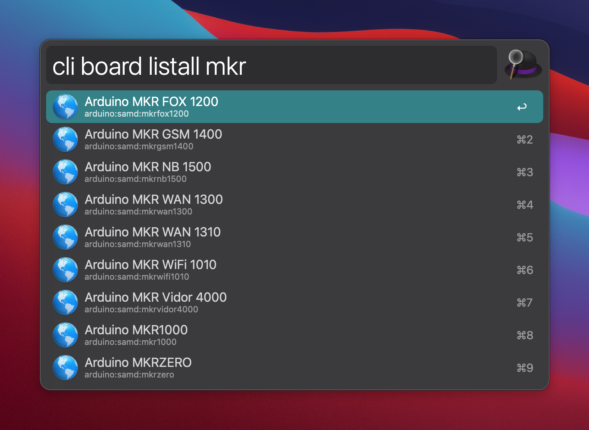

# Alfred Arduino CLI

Python based Workflow to run the Arduino CLI from [Alfred](https://www.alfredapp.com).

This project has been written as the companion example for the post https://zmoog.dev/post/alfred-workflow on my [personal website](https://zmoog.dev).
